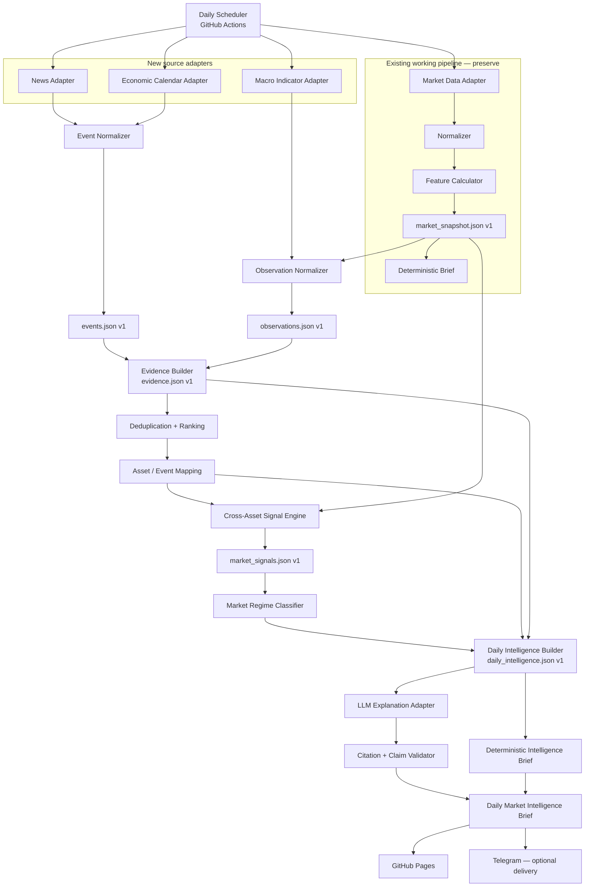

# AI Market Intelligence Pipeline — Architecture v2.0

> 目標：在保留現有 AI Market Brief MVP 的前提下，加入可追溯的事件、證據及跨資產分析層，把產品由價格摘要升級為每日市場情報系統。

## 1. 架構決策

本版本採用增量遷移，不重寫現有可運行模組。

- 保留 Market Data Adapter、Normalizer、Feature Calculator 及 `market_snapshot.json`。
- 保留 deterministic brief 作為資料管線 fallback。
- 保留 Mock LLM Adapter，直至 intelligence contracts 穩定及通過驗證。
- 保留 GitHub Actions、GitHub Pages 及現有 Telegram 邊界。
- 新模組透過 versioned JSON contracts 連接，不直接依賴供應商格式。
- LLM 只解釋已建立的 intelligence，不負責找新聞、計算數字或判定事實。
- 所有市場結論必須可追溯至 observation、event 及原始 source。
- 沒有足夠證據時輸出 `unconfirmed`，不得強行解釋價格變動。

## 2. 產品邊界

系統回答四個問題：

1. 今日發生了甚麼？
2. 為何值得留意？
3. 哪些資產可能受影響？
4. 未來 24–48 小時應監察甚麼？

系統不提供：

- 買入、賣出或倉位建議。
- 價格預測或回報保證。
- 自動交易、回測或投資組合管理。
- 未經證據支持的事件／價格因果判斷。
- 即時行情或事件驅動警報。

## 3. Target Architecture



## 4. Layer Responsibilities

| Layer | Responsibility | Must not do |
|---|---|---|
| Source adapters | Fetch market, news, macro and calendar data; retain source metadata | Make analytical conclusions |
| Normalization | Convert provider payloads into stable internal schemas | Guess missing facts |
| Evidence | Link observations and events to sources | Treat correlation as confirmed causation |
| Ranking and mapping | Deduplicate events, score relevance, map affected assets | Produce buy/sell signals |
| Intelligence engine | Build deterministic cross-asset signals and regime | Use LLM-generated facts |
| Brief generation | Explain structured intelligence in readable language | Invent prices, events or confidence |
| Validation | Check references, numbers, required sections and prohibited claims | Silently repair unsupported claims |
| Publishing | Render and distribute validated output | Expose secrets or present stale data as current |

## 5. Existing Modules to Preserve

| Existing component | Role in v2 | Change policy |
|---|---|---|
| `src/data/market_adapter.py` | Market price history provider | Keep public behavior stable |
| `src/data/normalizer.py` | Normalize market history | Keep output semantics stable |
| `src/features/calculator.py` | Deterministic market features | Reuse results; do not move calculations into AI |
| `src/models/schema.py` | Existing market snapshot contract | Preserve v1 compatibility |
| `src/pipeline.py` | Build `market_snapshot.json` | Remains independently executable |
| `src/brief/` | Price-only fallback report | Retain as degradation path |
| `src/ai/` | Adapter boundary and current mock | Replace implementation only after v2 inputs exist |
| `src/pages/` | Static output renderer | Adapt later to intelligence sections |
| `src/telegram/` | Optional delivery channel | Not part of intelligence computation |
| GitHub Actions | Daily orchestration and deployment | Add stages later; preserve current successful path |

## 6. New Modules

The paths below are architecture targets, not current implementation.

```text
src/
├── data/
│   ├── news_adapter.py
│   ├── macro_adapter.py
│   └── calendar_adapter.py
├── evidence/
│   ├── normalizer.py
│   ├── deduplicator.py
│   ├── ranker.py
│   ├── asset_mapper.py
│   └── builder.py
├── intelligence/
│   ├── cross_asset.py
│   ├── regime.py
│   ├── risk_monitor.py
│   └── builder.py
└── validation/
    ├── citation_validator.py
    └── claim_validator.py
```

## 7. Canonical Daily Artifacts

```text
src/output/
├── market_snapshot.json       # existing; market observations
├── macro_snapshot.json        # DXY, US10Y, VIX and WTI proxy records
├── economic_calendar.json     # next-48h official scheduled releases
├── news_items.json            # immutable validated adapter records
├── events.json                # normalized news and scheduled events
├── observations.json          # normalized market and macro observations
├── evidence.json              # traceable evidence bundles
├── market_signals.json        # deterministic cross-asset signals
├── daily_intelligence.json    # only structured input accepted by LLM
├── daily_intelligence_brief.md
└── ai_market_brief.md         # legacy output during migration
```

Detailed fields and validation rules are defined in [data-schema.md](data-schema.md).

Phase 6.2-B initially bounds calendar coverage to the official BLS release ICS
feed and the next 48 hours. `economic_calendar.json` is a provider artifact;
it does not yet replace canonical `events.json`. Impact and affected-asset
labels are deterministic relevance metadata, not claims that an event will
move those assets. Source failure produces an explicit failed artifact with no
synthetic events.

Phase 6.2-C keeps `news_items.json` separate from canonical `events.json`.
Headlines and provider metadata are source records; event type, entities,
topics and candidate assets are versioned normalization results. The detailed
design and implementation gate are defined in
[news-event-schema.md](news-event-schema.md).

News event lifecycle is independent from artifact data status. A stable event
may progress through `new`, `validated`, `confirmed`, `expired` or `retracted`
without changing its `event_id`. Verification levels and extraction/mapping
quality scores describe provenance and deterministic rule coverage; they are
not estimates of truth probability or market impact.

Phase 6.2-C1 implements only the source boundary using the Federal Reserve
Board's official all-press-releases RSS feed. It produces `news_items.json`;
Event Normalization, asset mapping, ranking, Evidence linkage and Intelligence
remain separate future stages.

## 8. Daily Processing Sequence

1. Run the existing market pipeline and produce `market_snapshot.json`.
2. Fetch a bounded window of news, macro releases and scheduled events.
3. Normalize all external items and reject records without required provenance.
4. Convert market snapshot and macro values into observations.
5. Deduplicate semantically equivalent events.
6. Rank events using recency, source quality, asset relevance and market impact.
7. Build evidence bundles linking events and observations.
8. Generate deterministic cross-asset signals.
9. Classify the regime as `risk_on`, `risk_off` or `mixed` with an explicit confidence.
10. Build `daily_intelligence.json` containing top events, signals, risks and next events.
11. Generate a Markdown brief from that single structured input.
12. Validate every citation, concrete number and claim reference.
13. If validation or LLM generation fails, publish the deterministic intelligence brief.
14. Deploy Pages; optionally deliver the same validated report through Telegram.

## 9. Evidence and Causality Rules

Every intelligence claim must declare one of these relations:

- `observed`: directly shown by a source or deterministic calculation.
- `associated`: event and market move are relevant and temporally related; causality is not confirmed.
- `supported_interpretation`: multiple observations support a cautious interpretation.
- `unconfirmed`: evidence is insufficient or conflicting.

The system must not emit `caused_by` in the MVP. Example:

```text
Allowed:
Gold rose while DXY and US yields declined. This pattern is consistent with
reduced dollar and yield pressure; the specific cause remains unconfirmed.

Not allowed:
Gold rose because the Fed will cut rates.
```

## 10. Source Policy

Sources are selected in this order:

1. Official institutions, exchanges and company investor-relations releases.
2. Primary regulatory or statistical publications.
3. Reputable news metadata with a stable URL and publication time.
4. Free aggregators only when licensing permits metadata use and the original URL is retained.

For every source item retain:

- provider and publisher.
- canonical URL.
- published and retrieved timestamps.
- source type and quality tier.
- title and short normalized summary only.
- content hash for deduplication.

The MVP must not republish full copyrighted articles.

### Phase 6.2-A approved macro proxies

| Internal symbol | Provider symbol | Meaning | Evidence caveat |
|---|---|---|---|
| DXY | `DX-Y.NYB` | U.S. Dollar Index level | Delayed Yahoo Finance proxy; ICE defines the benchmark |
| US10Y | `^TNX` | U.S. 10-year yield level | Daily change is expressed in basis points |
| VIX | `^VIX` | Cboe VIX Index level | Expected volatility benchmark, not observed market loss |
| OIL | `CL=F` | Front-month WTI futures | Futures price, not physical spot oil |

The Yahoo adapter is a zero-key Demo source with quality tier 3 and source
confidence `0.75`. Each record retains its Yahoo source URL and a separate
official semantic reference. Failure is isolated by instrument; there is no
silent provider substitution.

## 11. LLM Boundary and Validation

The LLM receives only `daily_intelligence.json`. Raw web pages, unranked feeds and provider payloads are excluded.

Before publication, validation must confirm:

- all referenced IDs exist.
- every concrete number matches a referenced observation.
- every event statement has a source URL and timestamp.
- confidence labels match the deterministic engine output.
- required sections exist.
- no buy/sell instruction or unsupported causal language appears.

Invalid output is rejected, not partially published. The deterministic brief becomes the fallback.

## 12. Failure and Degradation Model

| Failure | Required behavior |
|---|---|
| One market symbol fails | Continue; mark the observation failed |
| News source fails | Continue with remaining sources; disclose coverage gap |
| Macro source fails | Omit affected signals; lower regime confidence |
| Calendar unavailable | State that next-event coverage is unavailable |
| Evidence cannot be linked | Mark claim `unconfirmed` or omit it |
| Intelligence input incomplete | Produce partial deterministic brief |
| LLM timeout or invalid output | Publish deterministic intelligence brief |
| Page generation fails | Keep previous deployed page; retain artifact and failed run |
| Telegram fails | Do not fail report generation or Pages deployment |

## 13. Deployment Boundary

The v2 MVP remains a free daily batch system:

- Python on GitHub-hosted Actions.
- Static JSON, Markdown and HTML artifacts.
- GitHub Pages for public presentation.
- GitHub Secrets only for credentials.
- No database, server, streaming bus, React app or paid data dependency.

Static JSON files form an artifact-based evidence store for the MVP. A database is considered only after report usefulness and retention requirements are validated.

## 14. Architecture Acceptance Criteria

The pipeline becomes a Market Intelligence MVP only when:

- each published conclusion resolves to evidence and source records.
- at least one macro/news adapter and one calendar source are active.
- duplicate events are consolidated deterministically.
- top events include relevance reasons and affected assets.
- cross-asset signals expose their input observations and rule IDs.
- regime output includes score, confidence and conflicting evidence.
- unsupported causality is never presented as fact.
- the report contains Top Events, Cross-Asset Signals, Next 48 Hours and Risks.
- failure of the LLM does not prevent a useful intelligence report.
