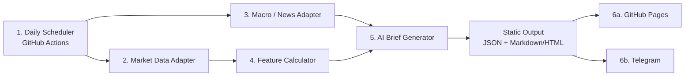
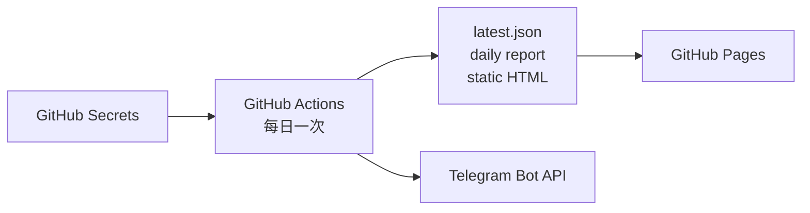

# AI Market Brief MVP — Architecture

> 架構目標：用六個核心元件，在 30 日內完成零固定平台成本的每日 AI Market Brief Demo。

## 1. 架構原則

- **Daily batch first**：每日執行一次，不建立串流或常駐服務。
- **Thin adapters**：保留 API／Adapter 邊界，但第一階段每類資料只接一個來源。
- **Static first**：所有輸出為 JSON、Markdown 或 HTML。
- **Deterministic facts**：市場數字及特徵由可重現計算產生。
- **AI as summarizer**：AI 整理已確認資料，不擔任數據來源。
- **Visible freshness**：所有數據顯示來源、`as_of` 及狀態。
- **Graceful output**：部分資料或 AI 失敗時，仍發布標明限制的基礎報告。
- **No third-party source modification**：不修改、複製或嵌入參考項目。

## 2. 30 日 MVP 架構

整個系統是一個可重跑的每日批次工作。沒有常駐 API、複雜資料庫或即時事件管線。

## 3. 六個核心元件

| 元件 | 第一階段責任 | 第一階段不負責 |
|---|---|---|
| Daily Scheduler | 每日觸發、手動重跑、避免同日重複發布 | 分鐘級排程、事件驅動工作 |
| Market Data Adapter | 擷取固定標的、轉換統一欄位、標示資料時間 | 多供應商切換、即時行情 |
| Macro / News Adapter | 擷取官方資料或 RSS metadata、保留來源連結 | 全網搜尋、全文保存、複雜實體識別 |
| Feature Calculator | 日／週變動、SMA20 趨勢、20 日波動率 | 大型指標庫、策略訊號 |
| AI Brief Generator | 由已確認資料產生一份 Daily Brief；提供非 AI fallback | 深度公司研究、平行研究流程 |
| Publisher | 產生靜態頁面並每日發送 Telegram 摘要 | 用戶登入、個人化推送、事件告警 |

## 4. 簡化資料流

1. Scheduler 建立當日 `run_date`。
2. Market Data Adapter 擷取固定資產清單。
3. Macro / News Adapter 擷取少量官方發布及新聞標題。
4. Feature Calculator 計算四項簡單特徵。
5. 系統組合一個結構化 Brief Input。
6. AI Brief Generator 產生文字摘要；失敗時使用固定模板。
7. Publisher 寫出 `latest.json`、當日報告及靜態頁面。
8. GitHub Pages 發布頁面。
9. Telegram 發送一次摘要及頁面連結。

流程失敗時不得補造資料。缺失 section 顯示 `unavailable` 或 `stale`。

## 5. 最小資料合約

第一階段只需要兩個 JSON 合約。

### `market_snapshot.json`

| 欄位 | 說明 |
|---|---|
| `run_date` | 批次日期 |
| `generated_at` | 檔案產生時間 |
| `instruments[]` | 固定資產清單 |
| `symbol` | 展示 symbol |
| `asset_class` | equity、crypto、gold-proxy、fx |
| `price` | 最新可用價格 |
| `daily_change_pct` | 日變動 |
| `weekly_change_pct` | 週變動 |
| `trend_vs_sma20` | above、below、unavailable |
| `volatility_20d` | 20 日波動率 |
| `as_of` | 供應商資料時間 |
| `source` | 來源名稱 |
| `status` | available、stale、unavailable |

### `daily_brief.json`

| 欄位 | 說明 |
|---|---|
| `report_date` | 報告日期 |
| `generated_at` | 報告產生時間 |
| `data_as_of` | 本次市場資料截止時間 |
| `market_summary` | 市場概況 |
| `notable_moves[]` | 主要價格變化 |
| `headlines[]` | 標題、來源、時間及 URL |
| `risks[]` | 資料限制及需注意事項 |
| `next_watch[]` | 下一交易日觀察項目 |
| `sources[]` | 來源清單 |
| `generation_mode` | ai 或 template |
| `status` | complete 或 partial |
| `disclaimer` | 非投資建議及延遲聲明 |

不建立獨立 Evidence、Event、Instrument Registry 或研究工作流資料庫。需要的來源資料直接包含在這兩份合約。

## 6. 技術選型

| 層 | 第一階段選型 | 理由 |
|---|---|---|
| 執行語言 | Python 3.12 | 金融資料及 AI 套件成熟 |
| 排程 | GitHub Actions | 無需常駐 server |
| 市場數據 | 一個免費 Provider Adapter | 快速驗證，失敗時明示 |
| 宏觀／新聞 | 官方 API／RSS 或一個免費來源 | 容易追溯及控制授權風險 |
| 計算 | Pandas 或等效輕量工具 | 足夠處理 8–12 個標的 |
| AI | 一個 LLM Adapter | 避免多模型路由 |
| 儲存 | JSON + Markdown／HTML | 可直接版本化及靜態發布 |
| Dashboard | 靜態 HTML + 輕量圖表 | 適合 GitHub Pages |
| 通知 | Telegram Bot API | 快速驗證每日推送 |
| 測試 | 基本單元測試及固定 fixture | 保護資料轉換及計算 |
| 監控 | GitHub Actions status 與 run summary | Demo 足夠 |

第一階段不使用：

- 複雜持久化、佇列或背景處理基建。
- FastAPI 或常駐 web server。
- 多模型 router。
- 多 Provider capability registry。
- 大型可觀測平台。

## 7. Adapter 邊界

只保留三個最小介面概念。

### Market Data Adapter

- Input：固定 symbol 清單、所需歷史日數。
- Output：價格時間序列、來源、`as_of`、狀態。
- Error：回傳 unavailable，不自動切換其他 Provider。

### Macro / News Adapter

- Input：固定主題或來源清單、日期窗口。
- Output：標題、發布時間、來源、URL。
- Error：允許新聞 section 為空，不阻塞市場報告。

### AI Adapter

- Input：已驗證的市場 snapshot 及新聞 metadata。
- Output：符合單一 Daily Brief 模板的結構化結果。
- Error：切換到 deterministic template。

Adapter 只隔離外部 API，不建立通用插件系統。

## 8. Feature Calculator

第一階段固定計算：

1. 日變動百分比。
2. 五個交易日變動百分比。
3. 最新價格高於或低於 SMA20。
4. 20 日年化或明確標示方法的波動率。

計算結果必須：

- 對缺失交易日及不足窗口作明確處理。
- 保留使用的資料截止時間。
- 不由 AI 修改。
- 使用固定 fixture 驗證。

## 9. AI Brief Generator

只建立一種輸出：`Daily Market Brief`。

### Input

- 固定資產的市場 snapshot。
- 四項特徵。
- 少量宏觀／新聞標題及來源。
- 報告時間、資料時間及缺失狀態。

### Output

- 一句話市場狀態。
- 主要資產變化。
- 2–5 項宏觀／新聞重點。
- 風險及資料限制。
- 下一交易日觀察項目。
- 來源及免責聲明。

### 護欄

- AI 不可生成輸入中沒有的具體市場數字。
- 無來源時不得聲稱某新聞造成價格變動。
- 不要求 AI 強行提供反證或投資結論。
- 輸出無效或服務不可用時使用模板版本。

## 10. 免費部署

| 元件 | 免費方案 | Demo 限制 |
|---|---|---|
| Compute | 公開 repo 的標準 GitHub-hosted runner | 排程可能延遲 |
| Web | GitHub Pages | 只提供靜態讀取 |
| Storage | repo 內有限歷史檔案 | 只保留最近 7–30 份報告 |
| Secrets | GitHub Actions Secrets | 不可進入前端或 logs |
| Telegram | Telegram Bot API | 每日一則摘要 |
| AI | 免費額度或用戶自備 Key | 超額時使用模板 |

平台固定成本目標為 US$0，但免費 Provider 的條款、配額及可用性仍需在實作前核對。

## 11. 可靠性與安全

### 每次 run 記錄

- `run_date`、開始及結束時間。
- 市場數據成功／過期／失敗數量。
- 新聞項目數量。
- AI 或模板生成模式。
- Pages 產物狀態。
- Telegram 發送狀態。

### 最小安全要求

- API Key 只存於 GitHub Secrets 或本機環境。
- 不在公開頁面、JSON、log 或 Telegram 顯示 secret。
- 不保存或再發布新聞全文，只保留 metadata、短摘要及原文連結。
- 所有報告附資料延遲及非投資建議聲明。
- 外部資料失敗時顯示缺失，不使用估算值冒充真實數據。

## 12. 30 日架構凍結

開發開始後 30 日內：

- 不新增資產類別。
- 不新增第二個 Market Data Provider。
- 不新增第二種 AI Brief。
- 不新增資料庫或 API server。
- 不新增即時或事件驅動功能。
- 不新增登入、自訂設定或商業化功能。

任何新需求先放入 Demo 後 backlog，不改變當前垂直切片。
