# Market Intelligence Engine — Functional Specification v1.0

> Historical design note: the implemented Phase 6.3-A and 6.3-B runtime
> contracts, plus the Phase 6.3-C Risk Monitor contract, are defined by
> `cross-asset-engine.md`, `market-regime-classifier.md`, and `risk-monitor.md`.
> Their frozen rules and schemas supersede the draft signal/regime/risk details
> in Sections 9–11 below.

> 本文件定義 deterministic intelligence layer 的行為。第一版不使用 LLM 作事件排序、訊號判定或 regime classification。

## 1. Objective

Intelligence Engine 將已 normalized 的市場、宏觀、新聞及日曆資料轉換為可追溯的市場情報：

- 今日最重要事件。
- 跨資產一致或矛盾訊號。
- 當前市場 regime。
- 主要資料風險及未來 48 小時事件。
- 供 Brief Generator 使用的 grounded claims。

它不預測價格，不產生交易訊號，亦不把相關性寫成已證實因果。

## 2. Required Inputs

| Input | Minimum requirement | Degraded behavior |
|---|---|---|
| `market_snapshot.json` | Existing supported assets and freshness | Missing symbols are excluded and disclosed |
| `events.json` | At least one validated source per event | No source means event is rejected |
| `observations.json` | Market observations plus available macro inputs | Rules with missing inputs become `insufficient_data` |
| Asset metadata | Canonical symbol, asset class and aliases | Unknown assets remain unmapped |
| Rule configuration | Versioned weights and thresholds | Unknown version fails validation |

Useful regime inputs, added incrementally:

- SPY and QQQ direction/trend.
- BTC direction/trend.
- Gold direction/trend.
- DXY or a clearly documented dollar proxy.
- US 10-year Treasury yield.
- VIX.
- Equity breadth when a reliable free source is available.

The engine must operate with partial inputs and lower confidence rather than fabricate missing values.

## 3. Processing Stages

```mermaid
flowchart LR
    Raw["Normalized events + observations"] --> Reject["Validation and rejection"]
    Reject --> Dedupe["Event deduplication"]
    Dedupe --> Map["Entity / asset mapping"]
    Map --> Rank["Event relevance ranking"]
    Rank --> Evidence["Evidence bundles"]
    Evidence --> Signals["Cross-asset rules"]
    Signals --> Regime["Regime scoring"]
    Regime --> Risks["Risk monitor"]
    Risks --> Output["daily_intelligence.json"]
```



Each stage emits deterministic results and warnings suitable for tests and audit.

## 4. Event Validation and Rejection

An event is eligible only when it has:

- a non-empty factual title.
- supported event type.
- original or canonical URL.
- publisher and retrieved timestamp.
- publication, occurrence or scheduled timestamp.
- content hash.

Reject:

- promotional content without market relevance.
- an item with only an aggregator URL when the original URL is available.
- unsupported language transformed into an unverified English/Chinese claim.
- anonymous social-media claims.
- items older than the configured report window unless they are still active scheduled events.

Rejected item counts and reasons appear in artifact warnings, not in the Brief.

## 5. News Deduplication

Deduplication runs before ranking.

### 5.1 Exact duplicate

Merge when any condition is true:

- identical canonical URL.
- identical provider item ID from the same provider.
- identical normalized title and publication time window.
- identical `content_hash`.

### 5.2 Near duplicate

Candidates are considered near duplicates when all apply:

- same event type or topic.
- publication times are within 12 hours.
- at least one common entity or candidate asset.
- normalized title token similarity meets the configured threshold.

The MVP should use deterministic token similarity; embeddings are deferred.

### 5.3 Canonical event selection

Choose the canonical source using:

1. lowest source quality tier.
2. original publisher over aggregator.
3. earliest verified publication timestamp.
4. most complete required metadata.

Keep all valid source references in the canonical event. Mark merged records with `duplicate_of`.

## 6. Asset and Topic Mapping

Mapping is rules-based and many-to-many.

### 6.1 Direct mapping

- Exact ticker or canonical asset name maps to that asset.
- Company name maps to its supported ticker.
- Crypto protocol names map to canonical crypto symbols.

### 6.2 Macro mapping

| Topic | Candidate assets |
|---|---|
| US monetary policy | SPY, QQQ, GOLD, DXY, US10Y, EURUSD, USDJPY, BTC-USD |
| US inflation | SPY, QQQ, GOLD, DXY, US10Y, EURUSD, USDJPY |
| US labour data | SPY, QQQ, DXY, US10Y |
| Dollar policy or intervention | DXY, GOLD, EURUSD, USDJPY |
| Crypto regulation | BTC-USD, ETH-USD; related equities only when directly named |
| Oil supply | OIL; broad assets only when evidence supports relevance |
| Geopolitical escalation | GOLD, OIL, SPY, QQQ; confidence starts low |

Candidate mapping means possible relevance, not confirmed price impact.

### 6.3 Mapping confidence

- `high`: exact ticker/entity or official asset-specific release.
- `medium`: controlled macro topic with documented mapping rule.
- `low`: broad thematic relevance.

Low-confidence mapping alone cannot place an event in the daily Top 3.

## 7. Event Relevance Ranking

The first version uses a transparent weighted score:

```text
relevance_score =
    0.25 × source_quality
  + 0.20 × recency
  + 0.20 × asset_relevance
  + 0.15 × scheduled_importance
  + 0.10 × observed_market_alignment
  + 0.10 × corroboration
```

All components are normalized to `0.0–1.0`.

### Component definitions

- `source_quality`: official/primary `1.0`; reputable direct publisher `0.8`; permitted aggregator `0.5`.
- `recency`: time decay within the report window; future scheduled events use time-to-event.
- `asset_relevance`: highest valid mapping confidence plus breadth of supported affected assets.
- `scheduled_importance`: configured calendar tier, never inferred by LLM.
- `observed_market_alignment`: relevant observations exist in the same window; it does not prove causality.
- `corroboration`: number and independence of valid sources, capped at `1.0`.

### Selection rules

- Publish at most three Top Events.
- Require `relevance_score >= 0.55` and confidence not `insufficient`.
- Avoid three items representing the same canonical event or topic unless independently material.
- If fewer than three qualify, publish fewer and explicitly state insufficient qualifying events.
- Store component scores so rankings can be audited.

## 8. Evidence Builder

Evidence Builder creates propositions from validated records without free-form generation.

Examples:

```text
Observed:
QQQ daily_change_pct = -1.4 and VIX daily_change_pct = +8.2.

Associated:
A central-bank release occurred within the same report window as moves in
yields and the dollar. Specific causality is unconfirmed.

Supported interpretation:
SPY and QQQ weakened, BTC weakened and VIX strengthened. Multiple inputs
support a defensive risk pattern.
```

Every bundle records supporting and contradicting inputs. Missing contradiction data must be stated as a limitation rather than treated as confirmation.

## 9. Cross-Asset Signal Rules

Initial rules are descriptive. Threshold values belong to versioned configuration and require fixture tests before implementation.

| Rule ID | Pattern | Output | Important caveat |
|---|---|---|---|
| `equity_crypto_risk_alignment_v1` | SPY/QQQ and BTC move in same risk direction | Aligned risk appetite | One day does not establish a trend |
| `equity_volatility_defensive_v1` | Equities weaker while VIX stronger | Defensive/risk-off pressure | Requires current VIX data |
| `gold_usd_yield_alignment_v1` | Gold stronger while DXY and US10Y weaker | Reduced dollar/yield pressure is supportive | Cause remains unconfirmed |
| `usd_fx_alignment_v1` | DXY and major FX pairs show consistent USD direction | Broad dollar signal | Quote direction must be normalized |
| `tech_divergence_v1` | QQQ diverges materially from SPY | Growth/technology divergence | Not a market-wide signal alone |
| `crypto_divergence_v1` | BTC/ETH diverge from equity risk assets | Crypto-specific divergence | Requires event check before interpretation |
| `trend_breadth_conflict_v1` | Index trend and breadth disagree | Internal market conflict | Only active with reliable breadth input |

### Signal state

- `active`: all required inputs current and rule threshold met.
- `inactive`: all required inputs current and threshold not met.
- `conflicting`: required inputs point in opposing directions.
- `insufficient_data`: one or more required inputs missing, stale or failed.

The report may explain active and conflicting signals. It should not narrate inactive rules.

## 10. Market Regime Classifier

Allowed output:

- `risk_on`
- `risk_off`
- `mixed`

This describes current observed conditions and is never a price forecast.

### 10.1 Input groups

| Group | Example inputs | Weight ceiling |
|---|---|---:|
| Equity risk | SPY, QQQ, breadth | 0.35 |
| Volatility | VIX | 0.20 |
| Crypto risk | BTC, ETH | 0.15 |
| Defensive assets | Gold, DXY, yields | 0.20 |
| Cross-asset consistency | active/conflicting signals | 0.10 |

Weights are re-normalized only across valid groups. A classification requires at least three valid groups including Equity risk or Volatility.

### 10.2 Score

Each input contributes `-1.0` to `+1.0`:

- positive values support `risk_on`.
- negative values support `risk_off`.
- values near zero or contradictory evidence support `mixed`.

Initial interpretation:

| Weighted score | Classification |
|---:|---|
| `>= +0.25` | `risk_on` |
| `<= -0.25` | `risk_off` |
| otherwise | `mixed` |

### 10.3 Confidence

Confidence combines:

```text
confidence =
    0.40 × data_coverage
  + 0.30 × input_freshness
  + 0.30 × signal_consistency
```

Confidence is capped at `low` when fewer than three input groups are valid. Conflicting signals must be listed even when the overall classification is risk-on or risk-off.

## 11. Risk Monitor

Risk Monitor produces watch conditions, not predictions.

Categories:

- data quality and missing coverage.
- scheduled macro or central-bank events in the next 48 hours.
- elevated or rising observed volatility.
- cross-asset divergence.
- concentration in a single equity or theme.
- conflicting evidence around the top-ranked event.

Allowed wording:

```text
Monitor whether VIX remains elevated while SPY and QQQ remain below SMA20.
```

Disallowed wording:

```text
Sell equities because the market will fall after the data release.
```

## 12. Claim Generation

Claims are built deterministically before the LLM:

1. Select an eligible event, signal or regime result.
2. Resolve all observation, evidence and source references.
3. Choose a versioned explanation template.
4. Insert only validated values.
5. Assign relation and confidence from engine output.
6. Attach limitations and contradictory evidence.

The LLM may improve readability but cannot change references, relation or confidence.

## 13. Hallucination and Causality Guardrails

The output validator must reject a report when:

- it contains a number not present in referenced observations.
- it cites an unknown event, signal, evidence or source ID.
- it uses causal phrases such as “caused”, “because of” or equivalent without an allowed relation.
- it upgrades `associated` or `unconfirmed` to a factual cause.
- it changes the regime classification or confidence.
- it adds a future price direction, trade instruction or certainty claim.

The safe fallback is a deterministic report generated directly from claims.

## 14. Daily Brief Content Contract

```markdown
# Daily Market Intelligence Brief

## Today's Three Most Important Events

## Market Overview

## US Equities

## Crypto

## Gold / Dollar / Commodities

## Forex

## Cross Asset Signals

## Next 48 Hours Events

## Risk Monitor

## Sources & Timestamp
```

Every event or analytical paragraph includes citation identifiers that the renderer can resolve to source links.

## 15. Testing Strategy

Before connecting live sources, implement fixtures for:

- exact and near-duplicate events.
- event ranking ties and insufficient Top Events.
- exact ticker and macro-topic asset mapping.
- missing/stale DXY, yield, VIX and breadth inputs.
- active, conflicting and insufficient cross-asset signals.
- risk-on, risk-off and mixed regime cases.
- contradictory evidence.
- unsupported number and citation rejection.
- LLM failure and deterministic fallback.

All deterministic fixtures must produce byte-stable structured JSON except for explicitly injected timestamps and run IDs.

## 16. MVP Acceptance Criteria

- At least 90% of published event claims resolve to a Tier 1 or Tier 2 source.
- 100% of concrete market numbers resolve to observation IDs.
- 100% of cross-asset signals expose their rule version and inputs.
- No duplicate canonical event appears twice in Top Events.
- Regime output always includes coverage, confidence and conflicts.
- No report publishes an unsupported causal claim.
- LLM-disabled operation still produces all required intelligence sections.
