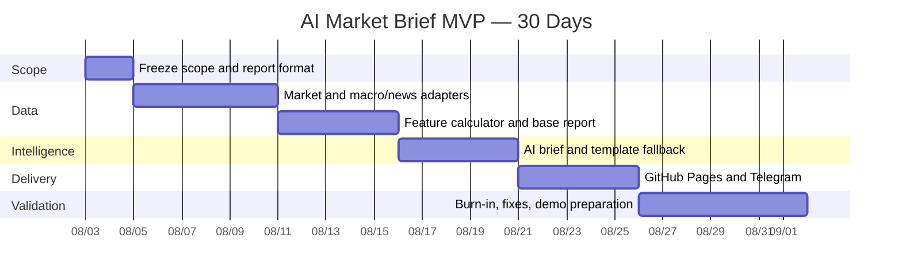

# AI Market Brief MVP — 30-Day Roadmap

> 目標：一名開發者在 30 日內完成零固定平台成本、可公開展示的每日 AI Market Brief。  
> 範圍：只建立每日排程、兩個資料 Adapter、特徵計算、AI Brief、Telegram 及 GitHub Pages。

## 1. Demo 完成定義

Day 30 時必須可以展示：

1. GitHub Actions 每日執行一次。
2. 固定 8–12 個跨資產標的的最新可用數據。
3. 每個標的的日變動、週變動、SMA20 趨勢及 20 日波動率。
4. 少量宏觀／新聞標題、來源、時間及原文連結。
5. 一份 AI Daily Market Brief。
6. AI 不可用時的模板 Brief。
7. GitHub Pages 最新報告頁面。
8. Telegram 每日摘要及 Dashboard 連結。
9. 最少 7 日 burn-in 記錄。

## 2. 30 日時序

總計：2 + 6 + 5 + 5 + 5 + 7 = 30 日。

## 3. Day 1–2 — Scope Freeze

### 目標

在開始開發前鎖定產品範圍及一份 Daily Brief 格式。

### 決定

- 固定 8–12 個 Demo 標的。
- 每日排程時間及報告時區。
- 一個免費 Market Data Provider。
- 一組官方宏觀／RSS 來源。
- 一個 LLM Provider 及每日使用上限。
- GitHub repo 是否保持 public。
- Telegram 測試 channel。
- 最新報告及歷史報告頁面 wireframe。

### 交付

- 最終 symbol 清單。
- Daily Brief 範例。
- `market_snapshot.json` 及 `daily_brief.json` 欄位確認。
- 免費 Provider 條款、配額及延遲限制記錄。

### Exit criteria

- 產品負責人批准固定範圍。
- 沒有未決 Provider 或資產清單。
- 所有新需求進入 Demo 後 backlog。

## 4. Day 3–8 — Data Adapters

### 目標

取得可追溯的市場、宏觀及新聞資料。

### Market Data Adapter

- 擷取固定標的所需的日線資料。
- 統一 symbol、價格、日期及來源欄位。
- 記錄 `as_of` 及 available／stale／unavailable 狀態。
- 來源失敗時輸出部分結果。

### Macro / News Adapter

- 擷取固定官方來源或 RSS。
- 保存標題、來源、發布時間及 URL。
- 使用簡單日期窗口、來源順序及固定關鍵字。
- 不保存新聞全文。

### Exit criteria

- 固定標的能產生一份帶來源的 snapshot。
- 缺失資料不會導致整個批次崩潰。
- 新聞項目均有來源及原文連結。
- 沒有加入第二個數據供應商。

## 5. Day 9–13 — Feature Calculator and Base Report

### 目標

在沒有 AI 的情況下完成可閱讀報告。

### 工作

- 計算日變動。
- 計算五個交易日變動。
- 計算 SMA20 趨勢。
- 計算 20 日波動率。
- 處理資料窗口不足及缺失交易日。
- 產生 `market_snapshot.json`。
- 以固定模板產生 Markdown／HTML Brief。
- 加入資料時間、來源、錯誤狀態及免責聲明。

### Exit criteria

- 不需要 LLM Key 亦能產生完整基礎報告。
- 所有數字由輸入數據及固定公式產生。
- 每個標的顯示 `as_of` 及狀態。
- 固定測試資料可以重現同一計算結果。

## 6. Day 14–18 — AI Brief Generator

### 目標

把基礎報告整理成一份五分鐘內看完的 AI Daily Market Brief。

### 工作

- 建立一個 Daily Brief prompt／輸出格式。
- AI 只讀取已驗證 snapshot 及新聞 metadata。
- 限制輸入新聞數量及輸出長度。
- 驗證 AI 不增加輸入中不存在的市場數字。
- 對服務失敗、超時及輸出無效切換到模板 Brief。
- 在報告記錄 `generation_mode`。

### Exit criteria

- AI Brief 包含市場概況、主要變化、新聞重點、風險及觀察項目。
- 具體市場數字全部可由 snapshot 找到。
- 不確認新聞因果時使用審慎語言。
- 關閉 AI 後仍可完成相同發布流程。

## 7. Day 19–23 — Publishing

### 目標

Day 23 前提供可分享的 Demo。

### GitHub Pages

- 顯示最新 Daily Brief。
- 顯示固定市場 snapshot。
- 顯示資料時間及來源連結。
- 保留最近 7–30 份歷史報告。
- 支援手機及桌面閱讀。

### Telegram

- 每日發送一則摘要。
- 包含生成時間、重要市場變化及 GitHub Pages 連結。
- 避免同一天重複發送。
- 不發送事件或盤中通知。

### Scheduler

- 每日 GitHub Actions 排程。
- 支援手動觸發。
- 在 run summary 顯示各步驟狀態。

### Exit criteria

- 公開連結可打開最新報告。
- Telegram 可收到摘要。
- Secret 不出現在頁面、產物或 log。
- 手動重跑不會產生重複 Telegram 訊息。

## 8. Day 24–30 — Burn-in and Demo Preparation

### 目標

連續運行、修正高風險問題並準備展示。

### 每日檢查

- Action 是否成功。
- 核心標的是否 available。
- `as_of` 是否合理。
- AI 是否加入不存在的市場數字。
- Pages 是否顯示最新報告。
- Telegram 是否只發送一次。

### 只修正

- 阻塞每日報告的錯誤。
- 錯誤數字、時間或來源。
- Secret／授權風險。
- 主要手機版閱讀問題。
- AI 明顯幻覺或輸出失敗。

### 不加入

- 新資產。
- 新指標。
- 新 Provider。
- 新 AI 報告類型。
- 用戶登入或自訂設定。
- 事件通知。
- 任何常駐後端或資料庫。

### Exit criteria

- 最少 7 日 burn-in。
- 排程成功率 ≥ 90%。
- 核心標的資料完整率 ≥ 95%。
- 無來源的具體市場數字為 0。
- 平台固定成本為 US$0。
- 可在五分鐘內完成一次完整 Demo。

## 9. 第一階段 P0

### 必須完成

- 每日排程。
- 一個 Market Data Adapter。
- 一個 Macro / News Adapter。
- 四項 Feature Calculator。
- 一個 AI Daily Brief。
- 非 AI 模板 fallback。
- GitHub Pages。
- Telegram 每日摘要。
- 資料時間、來源及免責聲明。

### 可以降低品質但不能阻塞

- 部分新聞來源暫時不可用。
- AI 免費額度耗盡。
- 個別非核心標的資料缺失。
- GitHub Actions 排程延遲。

### 絕不進入第一階段

- 即時或事件驅動功能。
- 平行 AI 研究流程或複雜編排。
- 複雜資料庫、資料湖或向量搜尋。
- 登入、多租戶、付款及個人化。

## 10. Demo 指標

| 類別 | Day 30 目標 |
|---|---|
| 可展示版本 | Day 23 前 |
| Burn-in | 7 日 |
| 排程成功率 | ≥ 90% |
| 核心資料完整率 | ≥ 95% |
| 有來源的市場數字 | 100% |
| 每日 Telegram 重複訊息 | 0 |
| 固定平台成本 | US$0 |
| 測試用戶 | 5 名 |
| 一週閱讀至少 3 次 | 至少 3 名 |

## 11. 主要風險

| 風險 | 30 日處理方式 |
|---|---|
| 免費行情失效或限流 | 顯示 unavailable；不臨時擴建多 Provider 系統 |
| 數據延遲 | 顯示 `as_of` 及 stale 狀態 |
| 新聞授權 | 只保存 metadata、短摘要及原文連結 |
| AI 幻覺 | AI 不計算數字；輸出對照 snapshot；保留模板 fallback |
| Actions 排程延遲 | 不提供即時承諾；支援手動重跑 |
| Scope creep | 30 日架構凍結；新需求進 backlog |
| Secret 洩漏 | 使用 GitHub Secrets；不輸出至 log 或靜態頁面 |

## 12. Day 30 後決策

Demo 完成後先回答：

1. 測試者是否持續閱讀 Brief？
2. 最常閱讀的是市場快照、新聞還是 AI 摘要？
3. 哪些內容被認為不可信或沒有價值？
4. 免費數據是否足以支持下一階段？
5. 用戶願意為甚麼能力付費？

只有獲得實際使用證據後，才制定下一階段產品及架構。Day 30 不自動開始擴建。
